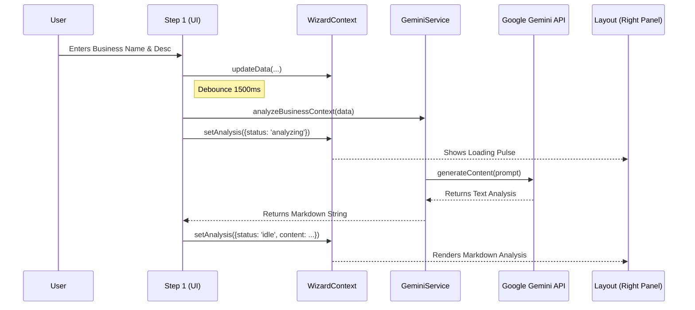

# Sun AI Agency — Technical Overview

**Version:** 0.1.0 (Alpha)
**Date:** October 2023
**Type:** Single Page Application (SPA)

This document outlines the technical architecture, technology stack, and application flows for the **Sun AI Agency** platform. The application is a "wizard-first" AI consultant that helps businesses structure their ideas before execution.

---

## 1. Technology Stack & Versions

The application utilizes a modern, build-less ES Module architecture for development speed, relying on `importmap` for dependency resolution.

| Category | Technology | Version | Source / Note |
| :--- | :--- | :--- | :--- |
| **Core Framework** | React | `^19.2.3` | via `esm.sh` |
| **DOM Rendering** | ReactDOM | `^19.2.3` | via `esm.sh` |
| **Routing** | React Router DOM | `^7.12.0` | `HashRouter` strategy |
| **AI SDK** | Google GenAI SDK | `^1.35.0` | `@google/genai` |
| **Styling** | Tailwind CSS | Latest (v3.4+) | CDN script injection |
| **Icons** | Lucide React | `^0.562.0` | via `esm.sh` |
| **Typography** | Google Fonts | N/A | Inter (Sans), Instrument Serif (Serif) |
| **Build Tool** | Vite | Latest | Implied by `metadata.json` / structure |

---

## 2. Directory Structure

The project follows a flat root structure typical of this specific development environment, conceptually organized as follows:

```
/
├── index.html                  # Entry HTML, Importmaps, Tailwind Config
├── index.tsx                   # React Entry Point (Mounts App)
├── App.tsx                     # Main Router Configuration & Layout Wrappers
├── metadata.json               # Application Metadata & Permissions
├── types.ts                    # TypeScript Interfaces & Enums
│
├── components/                 # UI Components
│   ├── WizardLayout.tsx        # Core 3-Panel Layout (Left: Nav, Center: Work, Right: AI)
│   └── ui/
│       └── Input.tsx           # Reusable Form Elements (Input, TextArea)
│
├── context/
│   └── WizardContext.tsx       # Global State (Business Data + AI Analysis State)
│
├── pages/                      # Page Views
│   ├── LandingPage.tsx         # Public Landing
│   ├── Dashboard.tsx           # Post-Wizard Client View
│   └── wizard/                 # Wizard Flow Steps
│       ├── Step1Context.tsx
│       ├── Step2Diagnostics.tsx
│       ├── Step3Recommendations.tsx
│       └── Summary.tsx
│
└── services/
    └── geminiService.ts        # Google Gemini API Integration layer
```

---

## 3. Routing & Sitemap

The application uses `HashRouter` for client-side routing stability.

### Route Configuration (`App.tsx`)

| Path | Component | Description | Access |
| :--- | :--- | :--- | :--- |
| `/` | `LandingPage` | Marketing entry point | Public |
| `/app` | `WizardLayout` | **Parent Route**: Wraps wizard steps in 3-panel layout | Protected (conceptually) |
| ├── `/wizard/step-1` | `Step1Context` | Business info input & AI Analysis trigger | Public |
| ├── `/wizard/step-2` | `Step2Diagnostics` | Industry-specific questions | Requires Step 1 |
| ├── `/wizard/step-3` | `Step3Recommendations` | System architecture proposals | Requires Step 2 |
| ├── `/wizard/summary` | `Summary` | Executive brief generation | Read-only |
| └── `/dashboard` | `Dashboard` | Final client view | Private |

### Sitemap Diagram


---

## 4. Workflows & Architecture

### Core Logic: The "Consultant" Pattern
Unlike standard forms, this app runs an AI analysis in parallel with user input.

1.  **Input:** User types description in `Step1Context`.
2.  **Trigger:** `useEffect` debounces input (1.5s delay).
3.  **Service:** `geminiService.ts` calls `ai.models.generateContent`.
4.  **State:** `WizardContext` updates `analysis.status` and `analysis.content`.
5.  **UI:** `WizardLayout` (Right Panel) reacts to state changes to show "Live Analysis".

### Data Flow Diagram



---

## 5. UI/UX Features

### Three-Panel Architecture (`WizardLayout.tsx`)
The application enforces a strict layout to separate concerns:

1.  **Left Panel (Context):**
    *   **Role:** Navigation & Status.
    *   **Features:** Read-only, displays progress steps, current step description.
2.  **Center Panel (Work):**
    *   **Role:** User Input & Decision.
    *   **Features:** Forms, Selection buttons, Primary interactions.
3.  **Right Panel (Intelligence):**
    *   **Role:** AI Feedback Loop.
    *   **Features:** Shows "Live Analysis", reasoning, and observation. It never edits the form directly; it only advises.

### Design System
*   **Fonts:** *Instrument Serif* for headings (Editorial feel), *Inter* for UI/Body (Cleanliness).
*   **Palette:** Stone (Greyscale warm) foundation with specific Accents (Gold/Amber).
*   **Components:** Custom `Input` and `TextArea` components styled to look like editorial forms (border-bottom only, no heavy boxes).

---

## 6. Services & Integration

### Google Gemini Integration
*   **File:** `services/geminiService.ts`
*   **Model:** `gemini-2.5-flash-latest` (Optimized for speed/latency in UI feedback).
*   **Authentication:** `process.env.API_KEY` injected at runtime.
*   **Fallback:** Includes a "Mock Analysis" mode if the API key is missing to ensure the UI remains functional during development/preview.

### State Management
*   **React Context:** `WizardContext` holds the "Single Source of Truth" for the session.
*   **Persistence:** Currently session-based (resets on refresh).
