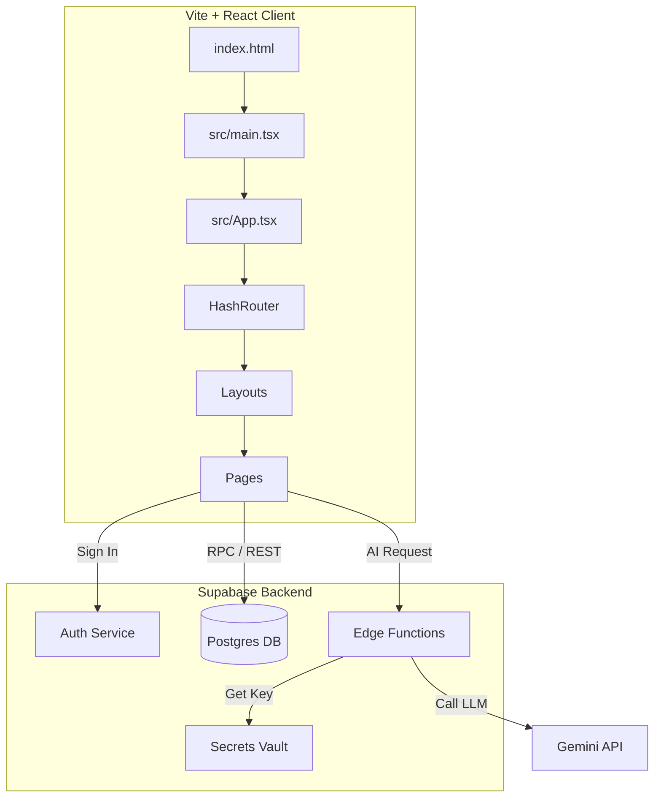
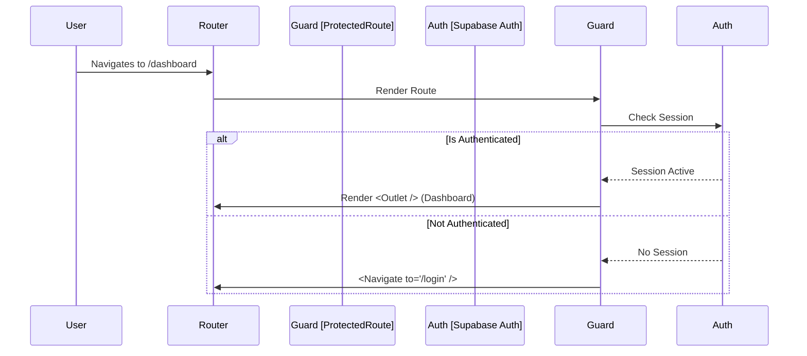

# Vite + React System Rules & AI Development Guardrails

**Version:** 1.1 (Refined Architecture)
**Context:** Production Vite + React + TypeScript Application
**Target:** AI Agents & Developers

---

## 1. Core Architecture Rules (Non-Negotiable)

1.  **Vite Sovereignty**: Vite is the sole build tool and dev server.
    *   **MUST NOT** use `importmap` in `index.html`.
    *   **MUST NOT** load React or ReactDOM via CDN tags.
    *   **MUST** resolve all dependencies via `package.json` and `node_modules`.

2.  **Runtime Environment**:
    *   Browsers **MUST NOT** execute `.ts` or `.tsx` files directly. All code must be compiled by Vite.
    *   Entry point is **Always** `src/main.tsx` via `<script type="module">`.

3.  **No Hybrid Models**:
    *   Legacy SPA patterns (manual DOM manipulation outside React, global variable dependency injection) are **FORBIDDEN**.
    *   All state must be managed within the React Component Tree or Context.

4.  **Case Sensitivity**:
    *   File imports **MUST** match the exact casing of the filename on disk.
    *   *Why?* Linux/Vercel builds fail if casing differs, even if it works on macOS/Windows.

---

## 2. File & Entry Point Invariants

### A. `index.html` Contract
The `index.html` file is static scaffolding.
*   **MUST** contain `<div id="root"></div>`.
*   **MUST** point to `<script type="module" src="/src/main.tsx"></script>`.
*   **ALLOWED**: Meta tags, font links, minimal analytics snippets (post-launch).
*   **FORBIDDEN**: Application logic, state initialization, or DOM manipulation scripts.

### B. `src/main.tsx` Responsibilities
This is the Bootstrapper. It **MUST**:
1.  Import global styles: `import './index.css'`.
2.  Find the root element (with null check).
3.  Create the React Root.
4.  Render the application wrapped in `<React.StrictMode>`.
5.  Render `<App />`.

### C. `src/App.tsx` Constraints
`App.tsx` is a **pure composition root**.
*   **MUST** render **ONLY** `<RouterProvider router={router} />`.
*   **MUST NOT** contain layout markup (Header, Footer, Sidebar).
*   **MUST NOT** contain routing logic or state.
*   **MUST NOT** use router hooks (`useNavigate`, etc.).

**Correct Pattern:**
```tsx
import { router } from './router';

function App() {
  return <RouterProvider router={router} />;
}
```

---

## 3. Styling Rules (Tailwind + CSS)

1.  **No CDNs**: Tailwind **MUST** be installed via `npm` and processed via PostCSS.
2.  **Config Invariants**:
    *   `tailwind.config.js` **MUST** have a `content` array covering all source files:
        ```js
        content: ["./index.html", "./src/**/*.{js,ts,jsx,tsx}"]
        ```
    *   Config file format (`export default` vs `module.exports`) **MUST** match the project's `type` in `package.json`.
3.  **CSS Entry**:
    *   `src/index.css` **MUST** contain `@tailwind` directives.
4.  **No Inline Styles**: Prefer Tailwind utility classes over `style={{ ... }}`.

---

## 4. Routing Rules (React Router v6+)

### A. Router Strategy
*   **Stage 2 (Current)**: **MUST** use `createHashRouter`.
    *   *Why?* Ensures reload stability on static hosts/previews without complex server configuration.
*   **Stage 3 (Future)**: Switch to `createBrowserRouter` only after Vercel rewrites are confirmed.

### B. Router Definition
*   Router **MUST** be defined in a dedicated file (e.g., `src/router.tsx` or `src/router/index.tsx`).
*   **MUST** use Route Objects array pattern, not JSX `<Route>` elements.

### C. Protected Routes Pattern
*   **MUST** use a Layout Wrapper pattern.
*   **MUST NOT** conditionally render routes inside the router config.

**Correct Pattern:**
```tsx
const router = createHashRouter([
  {
    path: '/',
    element: <RootLayout />,
    children: [
      {
        element: <ProtectedRoute />, // Renders <Outlet /> if auth, else <Navigate />
        children: [
          { path: 'dashboard', element: <Dashboard /> }
        ]
      }
    ]
  }
]);
```

---

## 5. Environment Variables & Security

### A. Variable Isolation
| Scope | Syntax | Example | Visibility |
| :--- | :--- | :--- | :--- |
| **Client** | `import.meta.env.VITE_*` | `VITE_SUPABASE_URL` | **PUBLIC** (Baked into build) |
| **Server** | `Deno.env.get` | `GOOGLE_API_KEY` | **PRIVATE** (Never exposed) |

### B. Security Hard Rules
1.  **AI Keys**: `GOOGLE_API_KEY` **MUST NEVER** appear in client-side code.
2.  **Edge Function Proxy**: All AI requests **MUST** go through Supabase Edge Functions.
3.  **CORS**: Edge Functions **MUST** implement specific CORS allowlists in production, not wildcard `*`.

---

## 6. Vercel Deployment Contract

1.  **Output Directory**: `dist`.
2.  **Install Command**: `npm install`.
3.  **Build Command**: `npm run build`.
4.  **Env Vars**: Variables must be set in Vercel Project Settings, **NOT** `.env.local` (except for dev).
5.  **Preview Parity**: If `npm run preview` fails locally, the deployment **WILL** fail.

---

## 7. Supabase Auth Redirect Rules

1.  **Redirect URLs**: Supabase Dashboard > Auth > URL Configuration **MUST** include:
    *   `http://localhost:5173` (Local)
    *   `https://<your-project>.vercel.app` (Production)
    *   `https://<your-project>-git-<branch>.vercel.app` (Preview patterns)
2.  **Session Persistence**: App **MUST** handle session restoration on reload via `onAuthStateChange`.

---

## 8. AI Behavior Rules (CRITICAL INSTRUCTIONS)

**To the AI Agent:** Before writing code, you **MUST** run this Preflight Checklist:

### AI Preflight Checklist
1.  [ ] **No Import Maps**: Confirm `index.html` has no `<script type="importmap">`.
2.  [ ] **Entry Point Valid**: Confirm `index.html` points to `src/main.tsx`.
3.  [ ] **Router Strategy**: Confirm `createHashRouter` is used.
4.  [ ] **No Secrets**: Confirm no API keys are being hardcoded in Client.
5.  [ ] **Imports Casing**: Confirm import paths match file names exactly.

**If any check fails**: STOP. Fix the configuration/architecture first.

---

## 9. Diagrams

### Architecture Overview


### Auth & Protection Flow


---

## 10. Final AI Contract

By operating on this codebase, the AI agrees to:
1.  **Never** downgrade to CDN/Import Maps.
2.  **Never** bypass the Edge Function for AI calls.
3.  **Always** verify `npm run build` compatibility.
4.  **Refuse** to implement "quick fixes" that violate these architectural rules.

**This document is the supreme law of the repository.**
