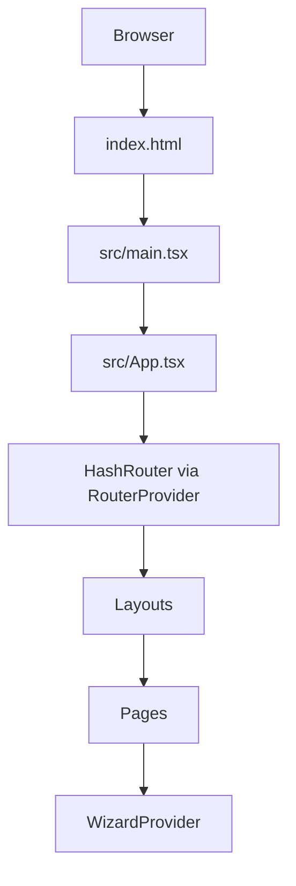

# Prompt: Fix Blank Screen & Refactor to Vite-Sovereign Architecture

## ROLE
You are a **Senior React Architect & Build Systems Engineer**.

You are working inside **Google AI Studio** on a **Vite + React + TypeScript** project that currently shows a **Blank / White Screen of Death**.

---

## GOAL
Fix the blank screen by **eliminating the hybrid CDN/importmap architecture** and refactoring the app into a **pure, production-grade Vite + Source architecture**.

The solution **MUST strictly follow these rules**:
- No `importmap`
- No CDN React / Tailwind
- No browser-executed `.tsx`
- Single Vite-controlled entry point

---

## PROBLEM CONTEXT (WHAT IS BROKEN)
The app is currently broken because:

1. `index.html` uses:
   - `<script type="importmap">` pointing to `esm.sh`
   - `cdn.tailwindcss.com`
   - Direct `.tsx` entry (`/index.tsx`)

2. Vite expects:
   - All dependencies from `node_modules`
   - A compiled entry at `src/main.tsx`

This causes **module resolution conflicts**, multiple React instances, and a **runtime crash before render**.

---

## REQUIRED FIXES (EXECUTE IN ORDER)

### 1️⃣ Sanitize `index.html`
- REMOVE:
  - `<script type="importmap">`
  - `<script src="https://cdn.tailwindcss.com">`
  - Inline `tailwind.config`
  - Inline `<style>` blocks
- ENSURE:
  ```html
  <div id="root"></div>
  <script type="module" src="/src/main.tsx"></script>
```

---

### 2️⃣ Enforce Vite-Owned Dependencies

* All dependencies MUST come from `package.json`
* NO CDN references (`esm.sh`, `unpkg`, `jsdelivr`, etc.)
* React, Router, Supabase, Lucide imported normally:

  ```ts
  import React from "react";
  ```

---

### 3️⃣ Move to Standard Vite Structure

Ensure this structure exists:

```text
/
├─ index.html
├─ src/
│  ├─ main.tsx
│  ├─ App.tsx
│  ├─ router.tsx
│  ├─ index.css
│  ├─ components/
│  ├─ pages/
│  ├─ context/
│  └─ services/
├─ tailwind.config.js
├─ postcss.config.js
├─ vite.config.ts
└─ tsconfig.json
```

---

### 4️⃣ Routing Architecture (NON-NEGOTIABLE)

* Use `createHashRouter`
* Define routes as **route objects** in `router.tsx`
* `App.tsx` MUST ONLY render:

  ```tsx
  <RouterProvider router={router} />
  ```
* Layout routes MUST render `<Outlet />`

---

### 5️⃣ Tailwind Setup (No CDN)

* Tailwind installed via npm
* `src/index.css` contains:

  ```css
  @tailwind base;
  @tailwind components;
  @tailwind utilities;
  ```
* Custom styles moved here from HTML

---

## ARCHITECTURE DIAGRAM (MERMAID)



---

## SUCCESS CRITERIA (MUST ALL PASS)

### Build & Runtime

* [ ] No `<script type="importmap">` in `index.html`
* [ ] No CDN URLs (`esm.sh`, `cdn.tailwindcss.com`)
* [ ] Browser does NOT load `.tsx` directly
* [ ] App renders without blank screen

### Console

* [ ] No module resolution errors
* [ ] No duplicate React warnings
* [ ] No `tailwind is not defined`
* [ ] No CORS errors

### Verification

* [ ] `npm run dev` works
* [ ] `npm run build` succeeds
* [ ] `npm run preview` renders the app
* [ ] Wizard routes render inside layout via `<Outlet />`

---

## FINAL INSTRUCTION

If **any step violates Vite sovereignty**, STOP and correct the architecture first.

Do **NOT** apply shortcuts or CDN-based fixes.

Deliver a **clean, stable, production-ready Vite + React app**.
