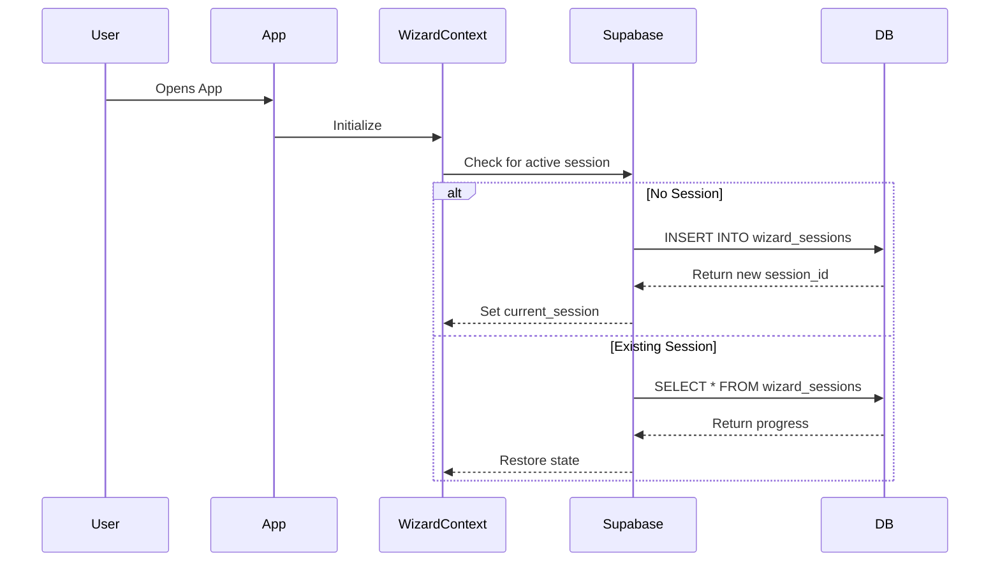

# 01 Infrastructure & Persistence Layer

## Progress Tracker
- [ ] **01 Infrastructure & Persistence**
- [ ] 02 Wizard Step 1: Business Context
- [ ] 03 Wizard Step 2: Industry Diagnostics
- [ ] 04 Wizard Step 3: System Selection
- [ ] 05 Wizard Step 4: Readiness Assessment
- [ ] 06 AI Agents Core Implementation

## Description
Establish the data persistence layer by integrating the Supabase client into the React frontend. Currently, the app uses in-memory state (`WizardContext`) which is lost on refresh. This step involves configuring the Supabase client, generating TypeScript types from the schema, and updating the context provider to load/save state to the database (`wizard_sessions` and `wizard_answers`).

## Goals
- Install and configure `@supabase/supabase-js`.
- Generate database types to `types/supabase.ts`.
- Create a `SupabaseService` or utility for data operations.
- Update `WizardContext` to initialize a session in `wizard_sessions` on start.
- Implement auto-save functionality in `WizardContext`.
- Ensure strict TypeScript typing for all DB operations.

## Mermaid Diagram


## Success Criteria
- `types/supabase.ts` exists and matches the 30-table schema.
- `lib/supabase.ts` (or equivalent) exports a typed client.
- Application starts without errors and creates a row in `wizard_sessions`.
- Refreshing the page retains the current step/session ID (via local storage or URL param).
- No sensitive keys are exposed in the client bundle (use `import.meta.env`).

## Production Ready Checklist
- [ ] Environment variables configured (`VITE_SUPABASE_URL`, `VITE_SUPABASE_ANON_KEY`).
- [ ] RLS policies confirmed (Anonymous/Public access allowed for wizard start if no auth yet).
- [ ] Error handling for network connectivity issues.
- [ ] Types generated using `supabase gen types`.

## Types
```typescript
// types/supabase.ts (Generated via CLI)
// Manually ensure these interfaces exist in app types:

export interface WizardSession {
  id: string;
  org_id: string; // logic to handle anon orgs or temp orgs
  current_step: number;
  created_at: string;
}
```

## Implementation Notes
- Since Auth is 0% implemented, assume an "Anonymous" or "Guest" flow for now, or create a temporary `org_id` for the session.
- Ensure `WizardContext` handles the loading state while checking Supabase.
