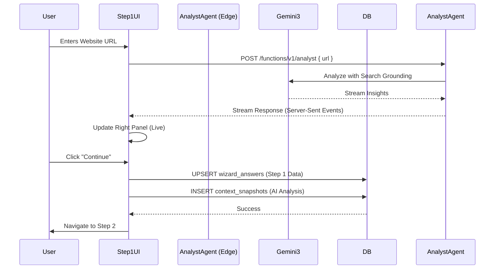

# 02 Wizard Step 1: Business Context

## Progress Tracker
- [x] 01 Infrastructure & Persistence
- [ ] **02 Wizard Step 1: Business Context**
- [ ] 03 Wizard Step 2: Industry Diagnostics
- [ ] 04 Wizard Step 3: System Selection
- [ ] 05 Wizard Step 4: Readiness Assessment
- [ ] 06 AI Agents Core Implementation

## Description
Build the first wizard screen that collects business information and triggers AI-powered research (Analyst Agent) to establish a baseline understanding of the user's business. Connect the existing UI to the Supabase backend and replace client-side Gemini calls with an Edge Function or secure server-side call.

## Goals
- Finalize Step 1 UI (Three-panel layout).
- Capture fields: Name, Business Name, Website, Industry, Description.
- **Trigger AI**: When Website URL loses focus, call `analyst` Edge Function.
- **Display**: Stream AI results (Industry classification, maturity, insights) to the Right Panel.
- **Save**: Persist form data to `wizard_answers` and AI analysis to `context_snapshots`.

## Mermaid Diagram

## Success Criteria
- User can enter URL and see "Live Analysis" in the right panel.
- Data is saved to `wizard_answers` table in Supabase.
- Analyst Agent returns Industry Classification and Maturity Score.
- Form validation blocks progress if required fields are missing.
- Loading states (skeletons/spinners) are visible during AI processing.

## Production Ready Checklist
- [ ] Input validation (Zod schemas).
- [ ] Debounce added to URL input to prevent API spam.
- [ ] Accessibility: ARIA labels for form inputs and live regions for AI results.
- [ ] Error handling: UI displays friendly error if Agent fails.

## Gemini 3 Features (Tools & Agents)
- **Model**: `gemini-2.5-flash` (UI responsiveness) or `gemini-3-pro` (Deep analysis).
- **Tools**: `googleSearch` (Grounding), `URL Context`.
- **Agent**: `Analyst` (Classifies industry, extracts maturity signals).

## Screen / Wireframe Details
- **Left Panel**: Progress "Step 1 of 4".
- **Center Panel**:
  - Input: Business Name.
  - Input: Website URL (Triggers AI).
  - Select: Industry (Auto-filled by AI if possible).
  - Textarea: Description.
  - Multi-select: Services.
- **Right Panel**:
  - Header: "Live Analysis".
  - Content: Streaming markdown of business insights.
  - Badges: "Verified Entity" (if Search Grounding confirms).
