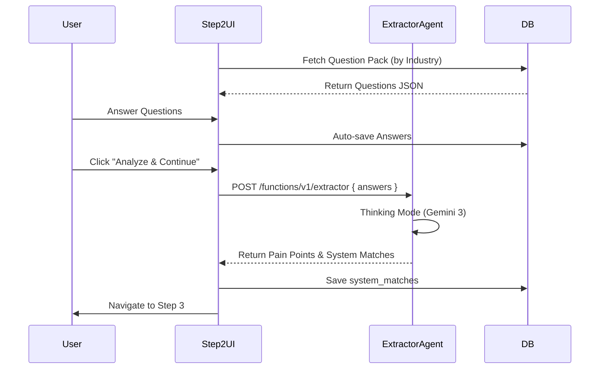

# 03 Wizard Step 2: Industry Diagnostics

## Progress Tracker
- [x] 01 Infrastructure & Persistence
- [x] 02 Wizard Step 1: Business Context
- [ ] **03 Wizard Step 2: Industry Diagnostics**
- [ ] 04 Wizard Step 3: System Selection
- [ ] 05 Wizard Step 4: Readiness Assessment
- [ ] 06 AI Agents Core Implementation

## Description
Present industry-specific diagnostic questions based on the industry detected/selected in Step 1. Collect user answers and use the **Extractor Agent** to identify pain points and map them to potential system solutions.

## Goals
- Load "Industry Pack" (questions) based on Step 1 data.
- Render dynamic question types (Rating, Multiple Choice, Text).
- Collect and save answers to `wizard_answers`.
- Trigger `extractor` Edge Function upon completion.
- Map identified pain points to `system_matches` in the database.

## Mermaid Diagram

## Success Criteria
- Questions change dynamically based on Industry (e.g., Retail vs. Agency).
- All answers are persisted.
- Extractor Agent successfully identifies at least 3 pain points from the answers.
- Pain points are visible in the Right Panel summary before moving to Step 3.

## Production Ready Checklist
- [ ] Fallback questions if Industry Pack is missing.
- [ ] Progress bar for question completion.
- [ ] Mobile responsive layout for complex question forms.
- [ ] Retry logic for Extractor Agent.

## Gemini 3 Features (Tools & Agents)
- **Model**: `gemini-3-pro`.
- **Config**: `thinkingConfig` (Budget: 2048 tokens) for deep diagnosis.
- **Agent**: `Extractor` (Parses unstructured answers into structured Pain Points).
- **Structured Output**: Returns JSON schema matching `PainPoint[]`.

## Screen / Wireframe Details
- **Left Panel**: "Diagnostics" Context.
- **Center Panel**: Question Cards (Stack or Scroll).
  - Question 1: "How do you handle X?" (Multiple Choice).
  - Question 2: "Rate your efficiency in Y" (1-10 Slider).
- **Right Panel**:
  - Real-time "Signal Detection".
  - As user answers, show "Pain Point Detected: Manual Data Entry" card fading in.
