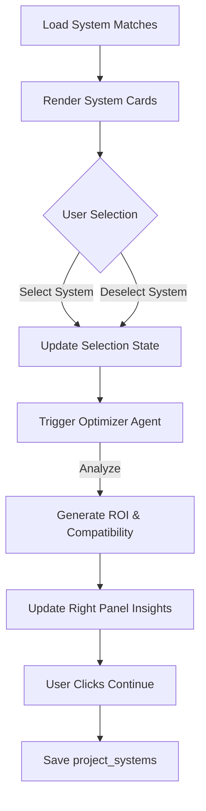

# 04 Wizard Step 3: System Selection

## Progress Tracker
- [x] 01 Infrastructure & Persistence
- [x] 02 Wizard Step 1: Business Context
- [x] 03 Wizard Step 2: Industry Diagnostics
- [ ] **04 Wizard Step 3: System Selection**
- [ ] 05 Wizard Step 4: Readiness Assessment
- [ ] 06 AI Agents Core Implementation

## Description
Present AI system recommendations based on pain points identified in Step 2. Allow users to select 1-3 systems and use the **Optimizer Agent** to validate the combination and project ROI.

## Goals
- Display recommended systems (from `system_matches`).
- UI for selecting/deselecting systems (Max 3).
- Trigger `optimizer` Edge Function to analyze the specific combination of selected systems.
- Save selections to `project_systems`.
- Display "Why for you" personalization for each card.

## Mermaid Diagram

## Success Criteria
- Recommendations are sorted by match strength.
- Selection is limited to 3 systems.
- Optimizer Agent returns a compatibility score for the selected stack.
- "Continue" button is disabled until at least 1 system is selected.

## Production Ready Checklist
- [ ] Detailed "Learn More" modal for each system.
- [ ] Visual indicators for "Best Match".
- [ ] Conflict detection (if two selected systems overlap too much).

## Gemini 3 Features (Tools & Agents)
- **Model**: `gemini-3-pro`.
- **Agent**: `Optimizer` (Evaluates system synergy).
- **Output**: Structured JSON containing ROI projections and Implementation Timeline estimates.

## Screen / Wireframe Details
- **Center Panel**: Grid of System Cards.
  - Card: Icon, Name, Match %, "Why this fits", Select Toggle.
- **Right Panel**: "Stack Analysis".
  - Dynamic ROI Calculator based on selected systems.
  - "Compatibility Check": Green checkmarks when systems play well together.
