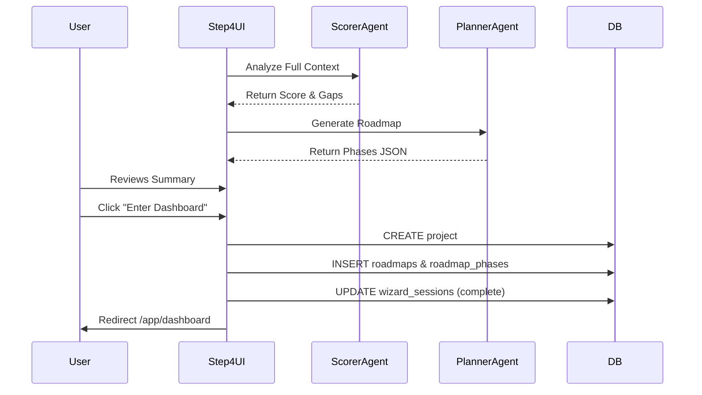

# 05 Wizard Step 4: Readiness Assessment

## Progress Tracker
- [x] 01 Infrastructure & Persistence
- [x] 02 Wizard Step 1: Business Context
- [x] 03 Wizard Step 2: Industry Diagnostics
- [x] 04 Wizard Step 3: System Selection
- [ ] **05 Wizard Step 4: Readiness Assessment**
- [ ] 06 AI Agents Core Implementation

## Description
Calculate a "Readiness Score" based on all previous data, display gaps and wins, and generate a strategic roadmap using the **Planner Agent**. This step bridges the wizard to the dashboard/project execution phase.

## Goals
- Calculate Readiness Score (0-100) using `scorer` Edge Function.
- Generate Executive Summary (Text) using `summary` Edge Function.
- Generate Roadmap (Phases/Tasks) using `planner` Edge Function.
- Create final `projects` record and link all session data.
- Transition user to Dashboard.

## Mermaid Diagram

## Success Criteria
- Readiness Score is deterministic and explained (e.g., "Low score due to missing data hygiene").
- Roadmap contains at least 3 phases with concrete tasks.
- Project is successfully created in the database.
- Dashboard route loads with the new project data.

## Production Ready Checklist
- [ ] Confetti or celebration animation on completion.
- [ ] PDF Export generation for the Executive Summary.
- [ ] Fallback if Roadmap generation times out.

## Gemini 3 Features (Tools & Agents)
- **Model**: `gemini-3-pro`.
- **Thinking Mode**: Enabled for `scorer` and `planner` to ensure logical phasing.
- **Agent**: 
  - `Scorer`: holistic analysis.
  - `Planner`: temporal planning and task breakdown.

## Screen / Wireframe Details
- **Center Panel**:
  - Big Score Gauge (e.g., "78/100").
  - "Gaps vs Wins" two-column layout.
  - Roadmap Preview (Timeline view).
- **Right Panel**:
  - "AI Coach": "You are ready to start. Your first phase focuses on Data."
