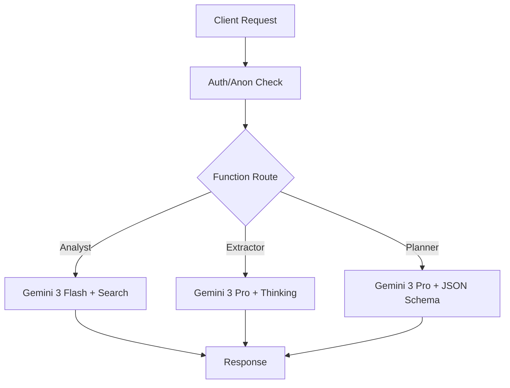

# 06 AI Agents Core Implementation

## Progress Tracker
- [x] 01 Infrastructure & Persistence
- [x] 02 Wizard Step 1: Business Context
- [x] 03 Wizard Step 2: Industry Diagnostics
- [x] 04 Wizard Step 3: System Selection
- [x] 05 Wizard Step 4: Readiness Assessment
- [ ] **06 AI Agents Core Implementation**

## Description
This prompt focuses on the backend Edge Functions that power the wizard. While previous steps integrated them into the UI, this step ensures their logic is robust, uses the correct Gemini 3 models, implements retries, and handles structured outputs correctly.

## Goals
- Implement `analyst` Edge Function (Search Grounding, URL Context).
- Implement `extractor` Edge Function (Structured Pain Points).
- Implement `optimizer` Edge Function (System logic).
- Implement `scorer` Edge Function (Math/Logic).
- Implement `planner` Edge Function (Roadmap JSON).
- Ensure all agents verify `org_id` (even if mocked/anon for now).

## Mermaid Diagram


## Success Criteria
- All 5 functions deployed and accessible via `supabase functions serve`.
- `analyst` returns real data from URLs.
- `extractor` correctly maps vague user answers to specific systems.
- `planner` produces valid JSON matching the `RoadmapPhase` type.

## Production Ready Checklist
- [ ] Rate limiting (Upstash or Supabase limitation).
- [ ] Cost tracking (Log token usage to `ai_run_logs` table).
- [ ] Timeout handling (Gemini calls can be slow).

## Gemini 3 Features (Tools & Agents)
- **Google Search Grounding**: Essential for `analyst`.
- **Thinking Mode**: Essential for `extractor` and `planner`.
- **Structured Outputs**: Essential for all except `analyst`.

## Types
```typescript
// Example Schema for Planner
type RoadmapPhase = {
  phase_name: string;
  duration_weeks: number;
  tasks: string[];
  outcome: string;
}
```
