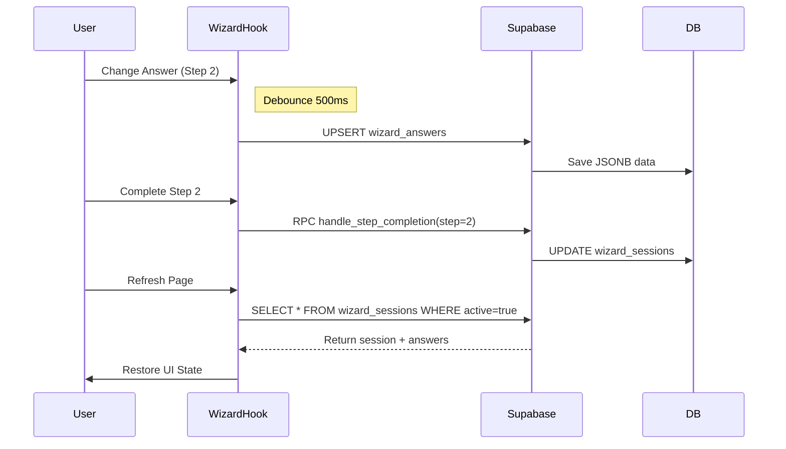

# 07 Data Persistence Layer

## Progress Tracker
- [x] 01 Infrastructure & Persistence
- [x] 02 Wizard Step 1: Business Context
- [x] 03 Wizard Step 2: Industry Diagnostics
- [x] 04 Wizard Step 3: System Selection
- [x] 05 Wizard Step 4: Readiness Assessment
- [x] 06 AI Agents Core Implementation
- [ ] **07 Data Persistence**
- [ ] 08 Client Dashboard: Overview
- [ ] 09 Client Dashboard: Brief
- [ ] 10 Client Dashboard: Roadmap
- [ ] 11 Client Dashboard: Billing

## Description
Implement the robust data persistence layer defined in Phase 1. This goes beyond simple session storage (Prompt 01) to handle complex multi-step state, auto-save strategies, and multi-tenant isolation. It bridges the Wizard flow to the core database tables (`wizard_answers`, `context_snapshots`, `system_matches`).

## Goals
- Implement logic for `wizard_sessions` to track detailed progress.
- Create specific save handlers for each wizard step to `wizard_answers`.
- Store AI analysis results in `context_snapshots` (Step 1) and `system_matches` (Step 2).
- Implement "Auto-Save on Blur/Change" logic in the frontend hooks.
- Handle session restoration (user comes back later).
- Enforce `org_id` isolation in all Supabase queries.

## Mermaid Diagram


## Success Criteria
- Form data persists across browser refreshes.
- AI analysis results (`context_snapshots`) are linked to the specific wizard session.
- Users cannot access sessions belonging to other Organizations (RLS check).
- Step navigation is blocked until data is successfully saved.

## Production Ready Checklist
- [ ] Retry logic with exponential backoff for network failures.
- [ ] Optimistic UI updates (don't block typing while saving).
- [ ] Error boundary for "Storage Quota Exceeded" (rare but possible).
- [ ] Validation before saving to DB.

## Types
```typescript
interface WizardAnswerRow {
  session_id: string;
  step_number: number;
  question_id: string;
  answer_data: any; // JSONB
  org_id: string;
}

interface ContextSnapshotRow {
  session_id: string;
  project_id?: string;
  industry: string;
  maturity_score: number;
  ai_summary: string;
  raw_analysis: any; // JSONB
}
```
