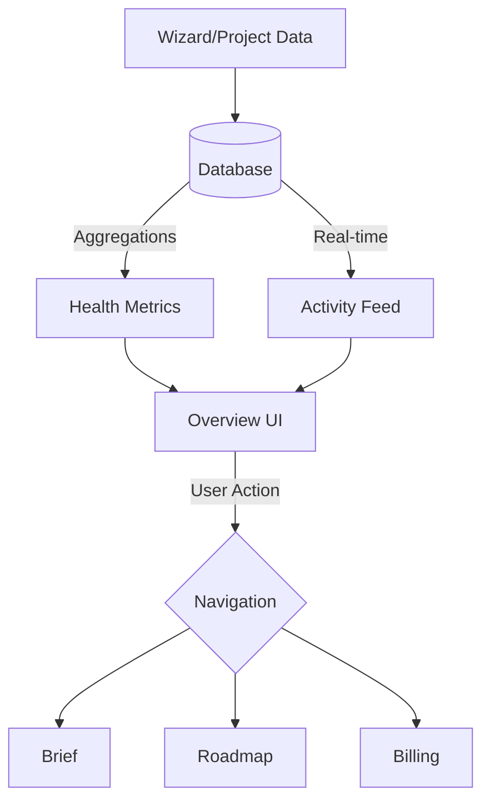

# 08 Client Dashboard: Overview

## Progress Tracker
- [x] 06 AI Agents Core Implementation
- [x] 07 Data Persistence
- [ ] **08 Client Dashboard: Overview**
- [ ] 09 Client Dashboard: Brief
- [ ] 10 Client Dashboard: Roadmap
- [ ] 11 Client Dashboard: Billing

## Description
Build the main entry point for the post-wizard experience. The Overview tab aggregates data from the wizard (Project creation) and displays health metrics, recent activity, and an "AI Advisor" panel.

## Goals
- Create the Dashboard Layout (similar to Wizard but focused on Management).
- Implement "Health Metrics Row": Score, Tasks, Budget, Risk.
- Build "Attention Items" feed (blockers, approvals).
- Build "Recent Activity" feed (database real-time subscriptions).
- Implement "AI Advisor" panel (Right side) offering proactive insights.

## Mermaid Diagram

## Success Criteria
- Dashboard loads project data generated by the Wizard.
- Health Score is visually distinct (Green/Yellow/Red).
- Real-time updates when tasks/phases change status.
- Responsive design handles the 3-column layout on desktop and stacked on mobile.

## Gemini 3 Features (Tools & Agents)
- **Agent**: `Assistant` (or `Advisor`).
- **Function**: Analyzes project velocity and risks to generate the "AI Advisor" insights on the right panel.

## Screen / Wireframe Details
- **Left Panel**: Project Metadata (Phase, Timeline).
- **Center Panel**: 
  - Top: 4-Grid Metrics (Health, Tasks, Budget, Risk).
  - Middle: "Attention Needed" List.
  - Bottom: Activity Stream.
- **Right Panel**: "AI Advisor" - Chat interface or Card stack with "Suggested Actions".
