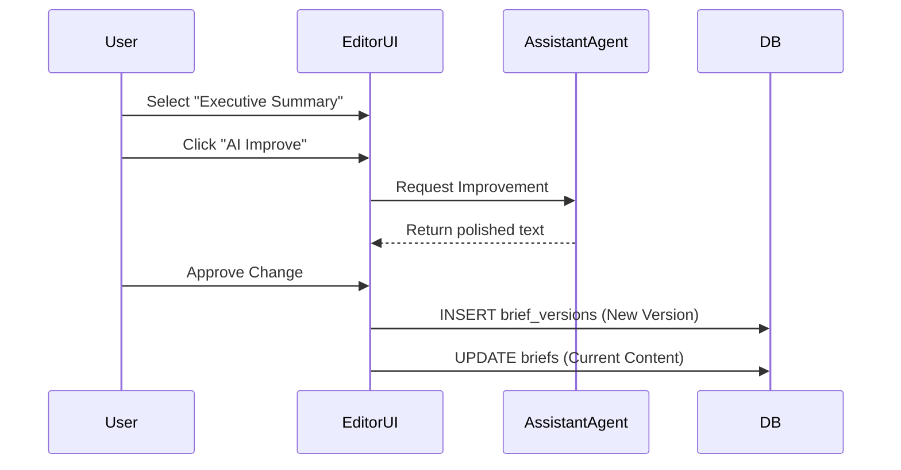

# 09 Client Dashboard: Brief

## Progress Tracker
- [x] 07 Data Persistence
- [x] 08 Client Dashboard: Overview
- [ ] **09 Client Dashboard: Brief**
- [ ] 10 Client Dashboard: Roadmap
- [ ] 11 Client Dashboard: Billing

## Description
Develop the "Strategic Brief" interface. This is a living document derived from the Wizard's executive summary. It supports rich text editing, versioning, and AI-assisted content improvement.

## Goals
- Display the generated Brief content (from Wizard Step 4).
- Implement a Rich Text Editor (or block editor) for sections.
- Enable "Version History" (viewing diffs from `brief_versions`).
- Document Management: Upload/List related files (PDFs/Images).
- **AI Integration**: "Improve this section" feature using Gemini.

## Mermaid Diagram

## Success Criteria
- Users can edit text and save changes.
- Version history accurately tracks who changed what and when.
- Documents can be uploaded and linked to the brief.
- AI Assistant correctly identifies context to improve specific sections.

## Gemini 3 Features (Tools & Agents)
- **Agent**: `Assistant`.
- **Capability**: Text rewriting, tone adjustment, and gap analysis based on Industry standards.

## Screen / Wireframe Details
- **Left Panel**: Document List & Version History list.
- **Center Panel**: The Brief (Document View).
- **Right Panel**: Contextual AI Assistant (Chat/Suggestions).
