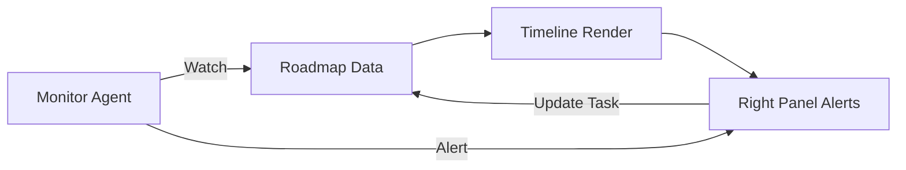

# 10 Client Dashboard: Roadmap

## Progress Tracker
- [x] 08 Client Dashboard: Overview
- [x] 09 Client Dashboard: Brief
- [ ] **10 Client Dashboard: Roadmap**
- [ ] 11 Client Dashboard: Billing

## Description
Build the interactive Roadmap view. This visualizes the execution plan generated in Wizard Step 4/5. It features a Gantt-style timeline, phase management, and task tracking.

## Goals
- Render Phases and Tasks on a Timeline (Gantt view).
- Task Details: Status, Assignee, Due Date dependencies.
- "Monitor Agent": AI analyzes progress vs. timeline to predict delays.
- Allow users to mark tasks as Done/Approved.
- Sync milestones with the timeline.

## Mermaid Diagram

## Success Criteria
- Timeline accurately reflects start/end dates.
- Dependencies are visualized (lines between tasks).
- AI Monitor proactively flags "Risk of Delay" if a task is overdue.
- Mobile view degrades gracefully (List view instead of Gantt).

## Gemini 3 Features (Tools & Agents)
- **Agent**: `Monitor`.
- **Capability**: Predictive analysis. "Based on current velocity, Phase 2 is likely to slip by 3 days."

## Screen / Wireframe Details
- **Center Panel**:
  - Phase Cards (Expandable).
  - Horizontal Timeline Visualization.
- **Right Panel**: "Project Monitor" - Risk alerts and resource recommendations.
