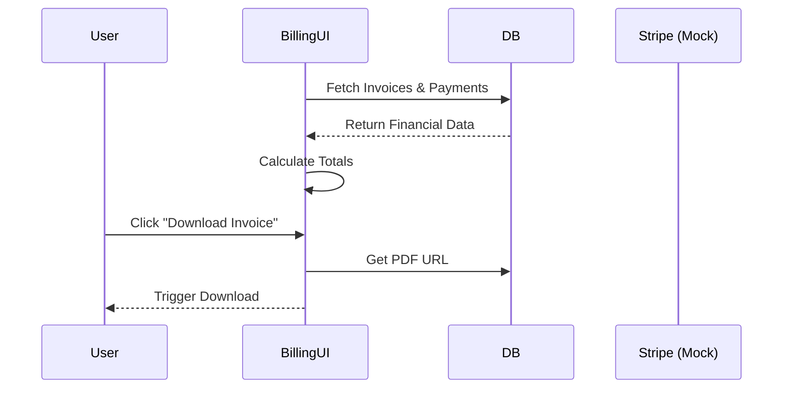

# 11 Client Dashboard: Billing

## Progress Tracker
- [x] 08 Client Dashboard: Overview
- [x] 09 Client Dashboard: Brief
- [x] 10 Client Dashboard: Roadmap
- [ ] **11 Client Dashboard: Billing**

## Description
Create the financial view for the client. This tab tracks invoices, payments, and upcoming schedules. It ensures transparency regarding budget usage.

## Goals
- Display Financial Summary (Total Due, Paid, Pending).
- List Invoices with status (Paid/Pending/Overdue).
- Show Payment History.
- Render "Payment Schedule" (Future projections based on roadmap phases).
- Enable Invoice PDF download (mock or real generation).

## Mermaid Diagram

## Success Criteria
- Math is accurate (Cents to Dollar conversion).
- Statuses are color-coded correctly.
- Linked Phases are shown next to invoice items.
- Empty states handled for new projects.

## Production Ready Checklist
- [ ] Secure file access for Invoice PDFs (Signed URLs).
- [ ] formatting currency based on locale.

## Screen / Wireframe Details
- **Left Panel**: Account Info & Summary Stats.
- **Center Panel**: 
  - Tab 1: Invoices (List).
  - Tab 2: Payment History.
- **Right Panel**: Financial Insights (e.g., "Budget usage is 10% lower than projected").
