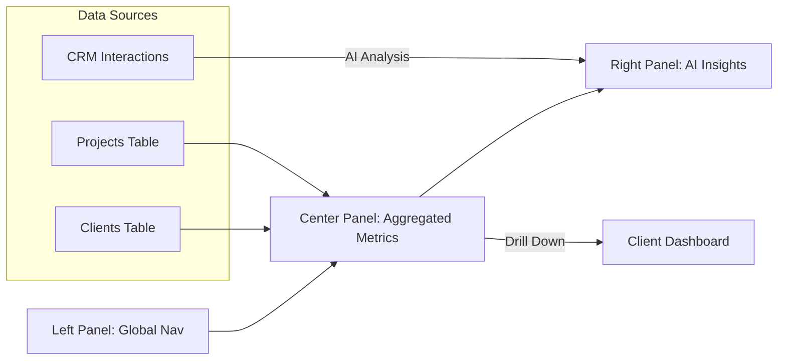

# 12 Agency Dashboard: Overview

## Progress Tracker
- [x] 08 Client Dashboard: Overview
- [x] 09 Client Dashboard: Brief
- [x] 10 Client Dashboard: Roadmap
- [x] 11 Client Dashboard: Billing
- [ ] **12 Agency Dashboard: Overview**
- [ ] 13 Agency Dashboard: Client List

## Description
Build the **Agency Dashboard** core structure. Unlike the single-tenant Client Dashboard, this view is designed for Agency Team Members to manage multiple client projects simultaneously. It features a specific layout optimized for high-level monitoring, health scoring, and quick navigation between client contexts.

## Goals
- Create the Agency Dashboard Layout (Sidebar navigation, Top bar with Org context).
- Implement **Multi-Client Overview** logic (fetching all clients under `org_id`).
- Implement **Health Scoring System** (Green/Yellow/Red based on project velocity and sentiment).
- Build the **AI Insights Panel** (Right Panel) for cross-client alerts (e.g., "3 Clients at risk").
- Define routing for `/agency` vs `/app` (Client View).

## Mermaid Diagram

## Success Criteria
- Agency users can see a high-level summary of all active clients.
- "At Risk" clients are visually highlighted.
- Navigation distinguishes clearly between "Agency View" and "Client View".
- Access Control: Users with `role: 'client'` cannot access this route.

## Production Ready Checklist
- [ ] Role-Based Access Control (RBAC) middleware on routes.
- [ ] Caching strategy for Health Scores (don't recalculate on every render).
- [ ] Mobile responsive layout (Collapsible sidebar).

## Gemini 3 Features (Tools & Agents)
- **Agent**: `CRM Intelligence`.
- **Function**: Scans recent `crm_interactions` and `project_status` to calculate a dynamic Health Score (0-100) and generate alerts.

## Screen / Wireframe Details
- **Left Panel (20%)**: 
  - Global Navigation (Clients, Projects, Team, Settings).
  - Quick Filter by Status (Lead, Active, Churned).
- **Center Panel (50%)**: 
  - **KPI Row**: Total Revenue, Active Projects, At-Risk Count.
  - **Status Overview**: Projects by Phase distribution.
- **Right Panel (30%)**: 
  - **AI Feed**: "Client X hasn't replied in 5 days", "Project Y is blocked on Approval".
