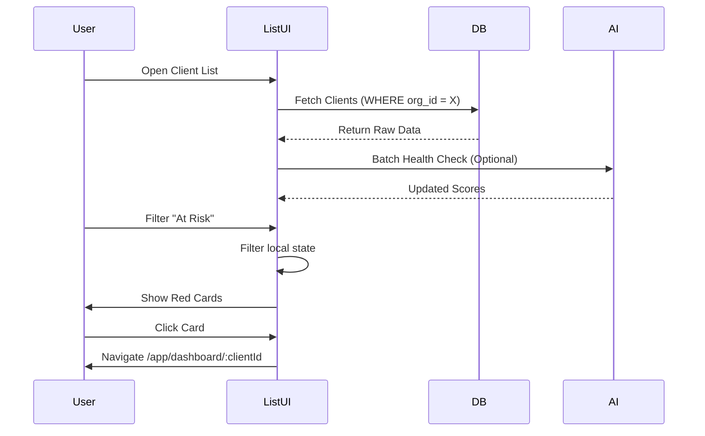

# 13 Agency Dashboard: Client List

## Progress Tracker
- [x] 11 Client Dashboard: Billing
- [x] 12 Agency Dashboard: Overview
- [ ] **13 Agency Dashboard: Client List**

## Description
Build the robust **Client List** component. This is the primary workspace for agency members. It requires advanced filtering, searching, and sorting capabilities to manage a potentially large roster of clients. It includes "Client Cards" that provide a snapshot of health and status.

## Goals
- Implement `ClientListContainer` with state for filtering, sorting, and search.
- Create `ClientCard` component showing: Status, Health Score, Project Phase, Last Activity.
- Implement Search (Name, Company) and Filter (Status, Health Range).
- Add "Quick Actions" menu to cards (Message, View Dashboard, Add Note).
- Real-time updates: Subscriptions to `clients` and `activities` tables.

## Mermaid Diagram

## Success Criteria
- Filtering by "Status" (Lead/Client) and "Health" (High/Low) works simultaneously.
- Search is instant (client-side for <500 records, server-side otherwise).
- Clicking a client card correctly switches context to that client's dashboard.
- "Skeleton" loading states for smooth UX.

## Production Ready Checklist
- [ ] Virtualization (if list exceeds 100 items).
- [ ] Debounced search input.
- [ ] Pagination logic (if server-side).
- [ ] Empty states for "No Clients Found".

## Gemini 3 Features (Tools & Agents)
- **Agent**: `CRM Intelligence`.
- **Integration**: Used to generate the "One-line insight" displayed on the Client Card (e.g., "Sentiment trending positive").

## Screen / Wireframe Details
- **Header**: Search Bar, "Add Client" Button, Sort Dropdown.
- **List Area**: Grid of Cards (Desktop) or Stacked List (Mobile).
  - **Card Visuals**: Color-coded borders based on Health Score.
  - **Actions**: Hovering reveals "Quick Actions" (Message, Call).
