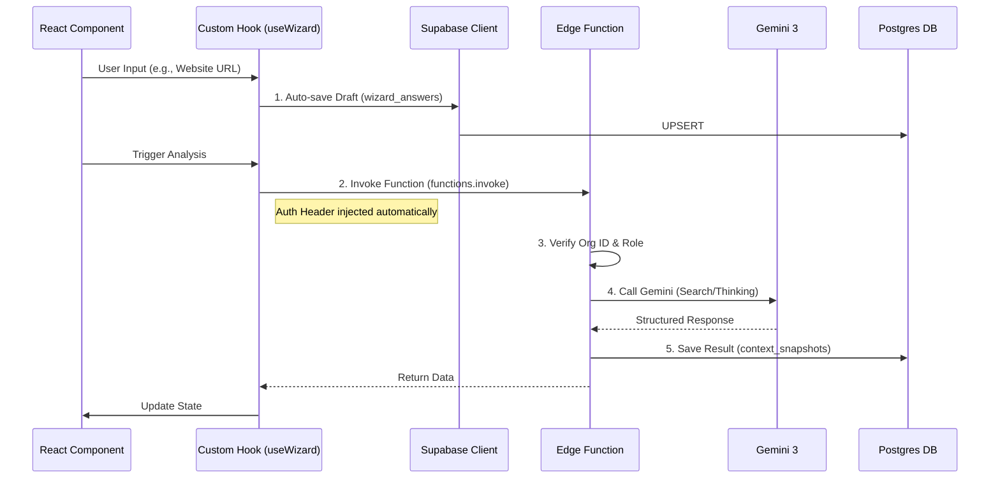

# Sun AI Agency — Implementation Roadmap

**Version:** 1.0.0  
**Status:** Phase 1 (Foundation) in progress  
**Architect:** Senior Product Architect  
**Target:** Production-Ready MVP with Gemini 3 Intelligence

---

## 1. Executive Summary & Gap Analysis

**Current State:**
*   ✅ **UI Shell:** High-quality React 19 + Tailwind UI for Wizard Steps 1-3.
*   ✅ **Schema:** Comprehensive Supabase schema (30 tables) and Edge Functions (17 defined).
*   ❌ **Wiring:** Frontend is purely client-side. No connection to Supabase Auth or Database.
*   ❌ **Security:** Gemini API keys are client-side (Critical Risk).
*   ❌ **Logic:** Wizard steps are mock-only; no real data persistence or AI processing via backend.

**Strategic Goal:**
Transition from a "Client-side Demo" to a "Secure, Persisted SaaS" by moving AI logic to Edge Functions and implementing the `React -> Supabase -> Edge Function` wiring pattern.

---

## 2. Architecture & Wiring

### Frontend-Backend Wiring Standard
All features must adhere to this data flow to ensure security and persistence.

### Tech Stack Upgrade
*   **Routing:** Migrate `HashRouter` -> `BrowserRouter` (Standard for SaaS).
*   **Styling:** Migrate CDN Tailwind -> PostCSS/Vite pipeline (Performance).
*   **State:** Move `WizardContext` from In-Memory -> `supbase-js` Subscription.

---

## 3. Gemini 3 Feature Integration Matrix

We will leverage specific Gemini 3 capabilities to differentiate the product.

| Feature | Model | Configuration | Use Case |
| :--- | :--- | :--- | :--- |
| **Search Grounding** | `gemini-3-flash` | `tools: [{googleSearch: {}}]` | Step 1: Verify business existence, find competitors. |
| **URL Context** | `gemini-3-flash` | `tools: [{codeExecution: {}}]` | Step 1: Scrape user website for services/tone. |
| **Thinking Mode** | `gemini-3-pro` | `thinkingBudget: 2048` | Step 2: Diagnose hidden operational bottlenecks from vague answers. |
| **Structured Outputs** | `gemini-3-pro` | `responseSchema` | Step 5: Generate valid JSON for Gantt Chart visualization. |
| **Function Calling** | `gemini-3-flash` | `tools: [functionDeclarations]` | Agent Orchestrator: Decide whether to generate text or query DB. |
| **Nano Banana Pro** | `gemini-nano-pro` | Image Gen | Generate "Future State" dashboard mockups for the proposal. |

---

## 4. Implementation Phases

### Phase 1: Foundation & Wiring (Days 1-3)
*Goal: Secure the app and establish data persistence.*

- [ ] **Infrastructure**: Initialize Supabase Client in `lib/supabase.ts` with Environment Variables.
- [ ] **Auth**: Implement minimal Anonymous Auth or Magic Link to generate `user_id` and `org_id`.
- [ ] **Persistence**: Connect `WizardContext` to `wizard_sessions` table.
    - *Action:* On mount, check for active session. If none, create new.
    - *Action:* Implement `autoSave` hook for form fields.
- [ ] **Security**: Remove `geminiService.ts` (Client-side). Move logic to `analyze-business` Edge Function.

### Phase 2: Wizard Logic & Intelligence (Days 4-7)
*Goal: Make the wizard smart using Gemini 3.*

- [ ] **Step 1 (Analyst Agent)**:
    - *Input:* URL/Business Name.
    - *AI:* Edge function calls `gemini-3-flash` with **Search Grounding**.
    - *Output:* Verified Industry + Confidence Score.
- [ ] **Step 2 (Extractor Agent)**:
    - *Input:* User answers (text/selection).
    - *AI:* Edge function calls `gemini-3-pro` with **Thinking Mode**.
    - *Output:* List of `PainPoints` mapped to `SystemIds`.
- [ ] **Step 3 (Optimizer Agent)**:
    - *Input:* Selected Systems.
    - *AI:* Calculate ROI and Implementation Complexity.
    - *Output:* Structured JSON.

### Phase 3: Client Dashboard (Days 8-12)
*Goal: Value delivery and retention.*

- [ ] **Overview Tab**: Fetch `projects` and `health_score`.
- [ ] **Brief Tab**: Render Markdown from `context_snapshots` with an Editor.
    - *Feature:* "AI Improve" button using **Function Calling** to rewrite sections.
- [ ] **Roadmap Tab**: Visualize `roadmap_phases` (Gantt).
    - *AI:* **Structured Output** guarantees valid date ranges and dependencies.

### Phase 4: Agency Dashboard & Multi-Tenancy (Days 13-15)
*Goal: Scaling for agency teams.*

- [ ] **Client List**: Grid view with aggregated Health Scores.
- [ ] **RBAC**: Middleware to prevent Clients from seeing Agency views.
- [ ] **Global Search**: RAG-powered search across all client documents.

---

## 5. AI Agents & Roles

| Agent Name | Role | Trigger | Gemini Config | Failure Path |
| :--- | :--- | :--- | :--- | :--- |
| **Analyst** | Researcher | Step 1 Submit | Flash + Search | Fallback to heuristic keywords |
| **Extractor** | Diagnostician | Step 2 Submit | Pro + Thinking | Ask clarification question |
| **Planner** | Project Manager | Step 4 Submit | Pro + Schema | Generate generic template |
| **Scorer** | Auditor | Data Change | Flash (Fast) | Keep previous score |
| **Guardian** | Compliance | Pre-Output | Pro (Strict) | Block unsafe content |

*New Suggestion:* **The Guardian Agent**. Runs in parallel to generation to ensure output matches specific Industry Compliance (e.g., HIPAA for Health, GDPR for EU Retail).

---

## 6. User Journeys

### Journey A: The Business Owner (Wizard Flow)
1.  **Land**: User arrives, clicks "Start".
2.  **Auth**: Anon session created behind scenes.
3.  **Context**: Enters URL. *Analyst Agent* confirms "I see you are a mid-size Fashion Retailer."
4.  **Diagnose**: User answers 3 questions. *Extractor Agent* finds "Inventory Sync Issue."
5.  **Proposal**: *Optimizer Agent* suggests "Unified Inventory OS".
6.  **Commit**: User creates account to save Roadmap.

### Journey B: The Agency Manager (Monitoring)
1.  **Dashboard**: Views "High Level" Agency Dash.
2.  **Alert**: *CRM Intelligence* flags "Client X Risk: No activity 7 days".
3.  **Action**: Click "Draft Check-in".
4.  **Draft**: *Content Agent* drafts email based on last known project status.
5.  **Send**: User approves and sends.

---

## 7. Acceptance & Verification

### Production Checklist
- [ ] **Env Vars**: `SUPABASE_URL`, `SUPABASE_ANON_KEY` set in Vercel/Netlify.
- [ ] **RLS**: Policies verified (Users can only see their `org_id` data).
- [ ] **Edge Functions**: `verify_jwt` set to `true` on all endpoints.
- [ ] **Gemini Quotas**: Rate limiting implemented (Upstash or Supabase limitation).
- [ ] **Fallback UI**: Loading skeletons for all AI states.

### Acceptance Test Example (Step 1)
*   **Given** a user enters "nike.com"
*   **When** they blur the input field
*   **Then** the UI shows a "Scanning..." skeleton
*   **And** the `analyst` edge function is called
*   **And** Gemini returns "Industry: Retail / Sportswear" via Search Grounding
*   **And** the result is saved to `context_snapshots` table
*   **And** the UI updates without a page refresh.

---

## 8. Frontend / Backend Wiring Guide

**Directory: `src/lib/`**
*   `supabase.ts`: Export typed `supabase` client.
*   `api.ts`: Wrapper for `supabase.functions.invoke`.

**Directory: `src/hooks/`**
*   `useWizard.ts`: Replaces the current Context logic.
    *   `saveStep(stepData)` -> Upserts to DB.
    *   `analyze(field)` -> Calls Edge Function.

**Directory: `supabase/functions/`**
*   `_shared/`: Common CORS headers and Gemini Client initialization.

---

## 9. Next Steps (Immediate)

1.  Execute **Prompt 01** (Infrastructure) to set up the Supabase Client.
2.  Execute **Prompt 02** (Step 1) to wire the first Edge Function.
