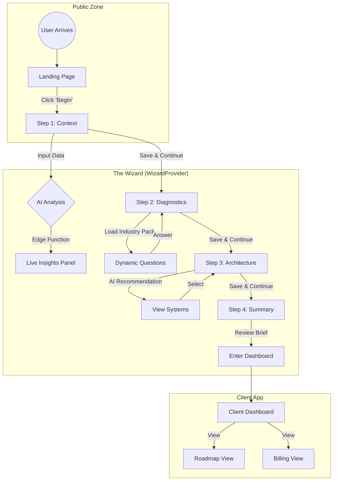

# Sun AI Agency — Application Sitemap

**Version:** 1.0.0  
**Context:** Vite + React + Supabase Architecture

---

## 1. Project Directory Structure

This tree reflects the flat-root architecture (Vite Standard) used in this application.

```text
/
├── index.html                   # Entry HTML (Tailwind & Font injection)
├── index.tsx                    # React Bootstrapper
├── App.tsx                      # Main Router & Layout Composition
├── metadata.json                # App Metadata & Capabilities
├── types.ts                     # TypeScript Interfaces (Shared)
├── CHANGELOG.md                 # Version History
├── lib/
│   └── supabase.ts              # Supabase Client Initialization
├── services/
│   └── aiService.ts             # AI Integration (Edge Function Proxy)
├── context/
│   └── WizardContext.tsx        # Global State (Session, Data, AI Analysis)
├── components/
│   ├── WizardLayout.tsx         # 3-Panel Shell (Context | Work | Intelligence)
│   └── ui/
│       └── Input.tsx            # Reusable Form Components
├── data/
│   ├── industryPacks.ts         # Industry Pack Resolver
│   └── packs/                   # Diagnostic Question Data
│       ├── agency.ts
│       ├── fashion.ts
│       ├── real_estate.ts
│       ├── saas.ts
│       ├── generic.ts
│       └── interfaces.ts
├── pages/
│   ├── LandingPage.tsx          # Public Home
│   ├── Dashboard.tsx            # Client Post-Wizard View
│   ├── AgencyDashboard.tsx      # Multi-tenant Agency View
│   └── wizard/
│       ├── Step1Context.tsx     # Business Profile & Analysis
│       ├── Step2Diagnostics.tsx # Industry Questions
│       ├── Step3Recommendations.tsx # System Architecture
│       └── Summary.tsx          # Executive Brief
├── supabase/
│   └── functions/
│       └── analyze-business/    # Edge Function: AI Analysis
└── docs/                        # Documentation
    ├── prd.md
    ├── roadmap.md
    ├── supabase.md
    ├── tasks/                   # Task Breakdown
    └── prompts/                 # Implementation Prompts
```

---

## 2. Routing Architecture

The application uses `HashRouter` (via `react-router-dom`) defined in `App.tsx`.

| Route Path | Component | Auth Level | Description |
| :--- | :--- | :--- | :--- |
| `/` | `LandingPage` | Public | Marketing landing page. Entry point. |
| **App Wrapper** | `WizardWrapper` | Session | Wraps `/app/*` routes with `WizardProvider` and `WizardLayout`. |
| ├── `/app/wizard/step-1` | `Step1Context` | Public/Anon | Business Context form. Triggers AI Analyst. |
| ├── `/app/wizard/step-2` | `Step2Diagnostics` | Session | Industry Diagnostics. Triggers Extractor. |
| ├── `/app/wizard/step-3` | `Step3Recommendations`| Session | System Selection. Triggers Optimizer. |
| ├── `/app/wizard/summary`| `Summary` | Session | Executive Brief & Roadmap preview. |
| └── `/app/dashboard` | `Dashboard` | Protected | Client Project Dashboard (Post-execution). |
| `/agency` | `AgencyDashboard` | Protected | Multi-tenant view for Agency Staff. |
| `*` | `Navigate to /` | Public | 404 Fallback. |

---

## 3. User Journey Flows

### A. The Client Onboarding Journey (The Wizard)



### B. The Agency Management Journey

```mermaid
graph TD
    subgraph "Authentication"
        Login((Agency Login)) -->|Auth Success| AgencyDash
    end

    subgraph "Agency Dashboard"
        AgencyDash[Agency Overview] -->|Filter| ClientList[Client List]
        ClientList -->|Select Client| ClientContext[Client Context View]
        
        AgencyDash -->|View| Alerts[AI Risk Alerts]
        Alerts -->|Click Alert| ClientContext
    end

    subgraph "Client Intervention"
        ClientContext -->|Jump to| ClientDash[Client Dashboard (Read/Write)]
        ClientDash -->|Edit| RoadmapConfig[Adjust Roadmap]
    end
```
