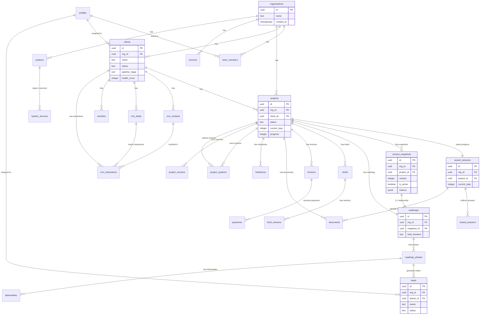
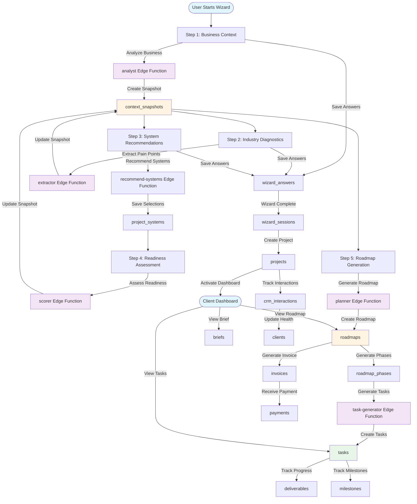

# Supabase Database Schema Summary

**Project:** Sun AI Agency v18  
**Database:** Supabase PostgreSQL  
**Last Updated:** 2025-01-27  

---

## Overview

**30 tables**, **1 view**, **17 Edge Functions** with comprehensive Row Level Security (RLS) for multi-tenant isolation. All tables use `org_id` for tenant isolation.

---

## Tables (30 total)

### Core Identity & Access (3 tables)
- `organizations` - Multi-tenant root entity (3 rows)
- `profiles` - User profiles linked to auth.users (0 rows)
- `team_members` - Organization membership with roles (0 rows)

### Client & Project Management (2 tables)
- `clients` - Client/lead records with CRM data (3 rows)
- `projects` - Project tracking (3 rows)

### Wizard Flow (2 tables)
- `wizard_sessions` - Wizard progress tracking, current_step (1-5) (3 rows)
- `wizard_answers` - Wizard step data stored as JSONB (3 rows)

### Strategy & Roadmap (3 tables)
- `context_snapshots` - Processed business context, versioned (3 rows)
- `roadmaps` - Strategic roadmaps, 1:1 with context_snapshots (3 rows)
- `roadmap_phases` - Roadmap phases with outcomes JSONB (3 rows)

### Execution & Task Management (3 tables)
- `tasks` - Execution tasks, owner: Client/Sun AI/Automated (3 rows)
- `deliverables` - Client deliverables (3 rows)
- `milestones` - Project milestones (3 rows)

### Service Catalog & Systems (5 tables)
- `services` - Service catalog, category: Core/Industry-Specific/Custom (3 rows)
- `systems` - AI system catalog (abstract systems like "growth-engine") (3 rows)
- `system_services` - System-service junction (3 rows)
- `project_systems` - Project-system relationships (3 rows)
- `project_services` - Project-service relationships (3 rows)

### Documents & Content (3 tables)
- `documents` - Document storage with vector embeddings (768 dim) for RAG (3 rows)
- `briefs` - Client project briefs, content stored as JSONB (3 rows)
- `brief_versions` - Brief version history with diffs (3 rows)

### Billing & Financial (2 tables)
- `invoices` - Client invoices, amount_cents (integer) for precision (3 rows)
- `payments` - Payment tracking with Stripe integration (3 rows)

### CRM & Relationship Management (5 tables)
- `crm_pipelines` - CRM pipelines (3 rows)
- `crm_stages` - Pipeline stages with win probability (13 rows)
- `crm_contacts` - Client contacts, supports multiple per client (9 rows)
- `crm_deals` - CRM deals/opportunities (5 rows)
- `crm_interactions` - Interaction history with vector embeddings (1536 dim) and sentiment analysis (8 rows)

### AI & Analytics (2 tables)
- `ai_run_logs` - AI call audit trail for cost tracking (3 rows)
- `ai_cache` - AI response cache keyed by prompt hash (3 rows)

### Activities & Timeline (1 table)
- `activities` - Activity timeline for client interactions (3 rows)

---

## Views (1)

- `client_crm_status` - Comprehensive client CRM status view with wizard status, dashboard access, and classification (SECURITY DEFINER)

---

## Edge Functions (17 active)

### Core AI Agents
- `analyst` - Business research and industry classification (v2)
- `extractor` - Pain point extraction from diagnostics
- `optimizer` - System optimization and recommendations
- `scorer` - Readiness scoring with weighted calculations
- `planner` - Strategic planning and roadmap generation
- `summary` - Executive summary generation
- `orchestrator` - Workflow orchestration and agent coordination

### Wizard Flow Functions
- `analyze-business` - Business analysis for wizard Step 1
- `generate-diagnostics` - Diagnostic question generation
- `assess-readiness` - Readiness assessment
- `recommend-systems` - System recommendations
- `generate-roadmap` - Roadmap generation

### Intelligence & Analytics
- `intelligence-stream` - Streaming intelligence updates
- `crm-intelligence` - CRM intelligence and health scoring
- `analytics` - Analytics processing
- `assistant` - General AI assistant
- `monitor` - System monitoring
- `task-generator` - AI task generation

**Note:** All functions have `verify_jwt: false` - should enable for production.

---

## Entity Relationship Diagram

---

## Data Flow Diagram

---

## Key Features

### Multi-Tenancy
- All tables include `org_id uuid not null` for tenant isolation
- RLS policies filter by `org_id` on all tables
- Service role bypass for Edge Functions

### Row Level Security (RLS)
- ✅ Enabled on all 30 tables
- Role-based access: Owner, Consultant, Client
- Users can only access data for their organization

### Vector Search (RAG)
- pgvector extension (v0.8.0) enabled
- `documents.embedding` - 768 dimensions
- `crm_interactions.embedding` - 1536 dimensions
- IVFFlat indexes for similarity search

### JSONB Storage
Used in 12 tables for flexible data:
- `wizard_answers.data` - Wizard step storage
- `context_snapshots.metrics` - Area scores
- `briefs.content` - Rich brief content
- `roadmap_phases.outcomes` - Phase outcomes
- `tasks.tags` - Task tags
- `invoices.line_items` - Invoice items
- And more...

### Financial Precision
- `invoices.amount_cents` - Integer (avoids floating point errors)
- `payments.amount_cents` - Integer
- Divide by 100 for display

### Database Functions (6)
- `update_updated_at()` - Auto-update timestamps (all tables)
- `handle_wizard_completion()` - Auto-set wizard_completed_at
- `handle_client_onboarding()` - Auto-set onboarded_at
- `handle_dashboard_activation()` - Auto-set dashboard_activated_at
- `handle_new_crm_interaction()` - Update last_activity_at
- `get_client_classification()` - Helper function for client classification

---

## Extensions

- `pgvector` (v0.8.0) - Vector similarity search
- `pgcrypto` (v1.3) - Cryptographic functions
- `uuid-ossp` (v1.1) - UUID generation
- `pg_stat_statements` (v1.11) - Query statistics
- `supabase_vault` (v0.3.1) - Secrets management
- `pg_graphql` (v1.5.11) - GraphQL support

---

## Security Notes

### Current Issues
1. ⚠️ All Edge Functions have `verify_jwt: false` - should enable for production
2. ⚠️ View `client_crm_status` uses SECURITY DEFINER
3. ⚠️ Extension `pgvector` installed in `public` schema

### Security Status
- ✅ RLS enabled on all 30 tables
- ✅ Multi-tenant isolation via `org_id`
- ✅ Foreign key constraints maintain integrity

---

## Status Columns

Most tables include status tracking:
- `projects.status`: Discovery, Active, Archived
- `clients.status`: lead, client, prospect
- `tasks.status`: todo, in_progress, review, done
- `invoices.status`: draft, sent, paid, overdue, cancelled
- `briefs.status`: draft, in_review, approved
- And more...

---

## Summary Statistics

- **Total Tables:** 30
- **Views:** 1
- **Edge Functions:** 17 (all active)
- **Database Functions:** 6
- **Triggers:** Multiple (auto-update timestamps, business logic)
- **Migrations:** 43 applied
- **RLS:** Enabled on all tables
- **Multi-Tenancy:** org_id-based on all tables
- **Vector Support:** pgvector for RAG
- **JSONB Tables:** 12 tables use JSONB for flexible data
