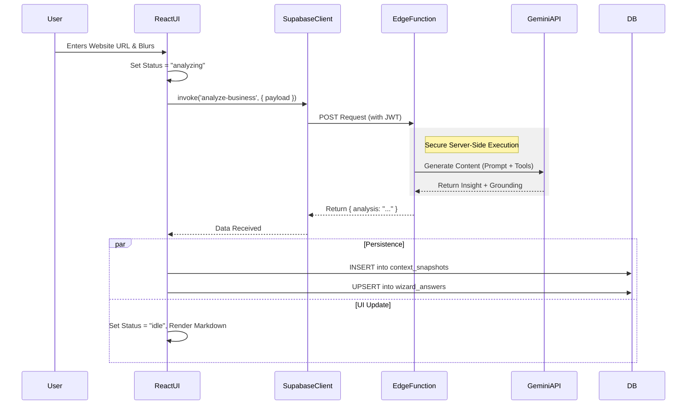
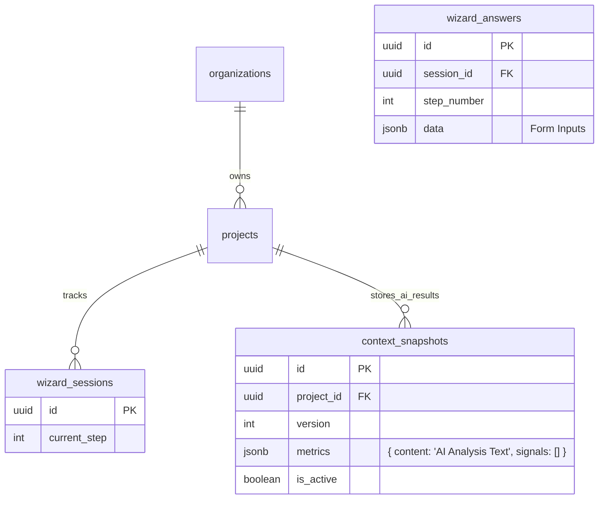

# 🏗️ Task: Connect Frontend to Supabase Edge Functions (Gemini 3)

**Status:** 🟡 In Progress
**Priority:** High
**Architect:** Senior System Architect

---

## 1. 📊 Progress Tracker

| Phase | Task | Status | Goal |
| :--- | :--- | :--- | :--- |
| **Phase A** | **Edge Function Infrastructure** | 🟡 In Progress | Deploy `analyze-business` and ensure it can accept requests and call Gemini API. |
| **Phase B** | **Frontend Integration** | 🔴 Not Started | Replace client-side mock calls with `supabase.functions.invoke`. |
| **Phase C** | **Data Persistence** | 🔴 Not Started | Save AI results to `context_snapshots` table to prevent re-fetching. |
| **Phase D** | **Security Hardening** | 🔴 Not Started | Ensure API keys are server-side only and CORS is configured. |
| **Phase E** | **Production Validation** | 🔴 Not Started | Verify error handling, timeouts, and loading states. |

---

## 2. 🗺️ Step-by-Step Implementation Plan

### A. Frontend Architecture (The Requestor)

**Location:** `src/services/aiService.ts` & `src/pages/wizard/Step1Context.tsx`

1.  **Trigger Point:**
    *   Currently, the analysis triggers on `onBlur` of the Website field or after a debounce on the Description field.
    *   **Change:** Retain this trigger, but switch the execution logic from local string generation to a remote server call.

2.  **State Management (`WizardContext`):**
    *   `status`: Transitions from `idle` → `analyzing` (show skeleton) → `complete` (show markdown) or `error` (show retry).
    *   `content`: Stores the raw Markdown returned by the Edge Function.

3.  **The Payload:**
    *   The frontend sends a JSON object containing: `businessName`, `industry`, `description`, `website`, `services`.
    *   It **must** invoke using `supabase.functions.invoke('analyze-business', ...)` to automatically pass the user's JWT (Auth header).

### B. Edge Functions (The Processor)

**Location:** `supabase/functions/analyze-business/index.ts`

1.  **Responsibility:**
    *   Receive the JSON payload.
    *   Validate the `API_KEY` exists in the server environment (Supabase Secrets).
    *   Initialize Gemini Client (`@google/genai`).
    *   **Gemini 3 Configuration:**
        *   Use `gemini-3-flash` for speed.
        *   Enable `googleSearch` tool for grounding (verifying the website).
    *   Return a clean JSON response: `{ "analysis": "Markdown string...", "signals": [...] }`.

2.  **Validation:**
    *   Ensure the request is `POST`.
    *   Handle CORS `OPTIONS` pre-flight requests to allow the frontend to talk to the Edge Function.

### C. Data Flow & Persistence (The Memory)

**Logic:**
We do not want to pay for an AI call every time the user refreshes the page.

1.  **Check Local State:** If `WizardContext.analysis.content` exists, show it.
2.  **Check Database:** If local state is empty, query `context_snapshots` table for the latest entry for this `project_id`.
3.  **Run Live Analysis:** If both are empty:
    *   Call Edge Function.
    *   **On Success:**
        1.  Update React Context.
        2.  **Save to DB:** Insert record into `context_snapshots` (JSONB column `metrics` stores the text).
        3.  **Save to DB:** Upsert `wizard_answers` (Step 1 form data).

---

## 3. 📐 System Diagrams

### Sequence Flow: Live Analysis

### Entity Relationship (Context Storage)

---

## 4. 🤖 Implementation Prompts

Use these prompts sequentially to build the feature.

### Prompt 1: Deploy Core Edge Function
> **Goal:** Get the backend running.
> "Create or update `supabase/functions/analyze-business/index.ts`. It should:
> 1. Accept a POST request with CORS headers.
> 2. Initialize `GoogleGenAI` using `Deno.env.get('API_KEY')`.
> 3. Use the `gemini-3-flash-preview` model.
> 4. Include the `googleSearch` tool in the config.
> 5. Prompt the model to analyze the business based on the input JSON.
> 6. Return a JSON response `{ analysis: string }`.
> Ensure error handling returns proper 500 status codes."

### Prompt 2: Frontend Service Integration
> **Goal:** Connect frontend to backend.
> "Update `src/services/aiService.ts`.
> 1. Remove the mock local generation logic.
> 2. Use `supabase.functions.invoke('analyze-business', ...)` to call the edge function.
> 3. Add error handling to catch network failures.
> 4. Return the analysis string string to the caller."

### Prompt 3: Persistence Wiring
> **Goal:** Save results to DB.
> "Update `src/pages/wizard/Step1Context.tsx`.
> 1. Inside the `useEffect` trigger for analysis:
> 2. After receiving the result from `aiService`, call `saveSnapshot(result)` from `WizardContext`.
> 3. Ensure `saveSnapshot` inserts a new record into the `context_snapshots` table with `is_active: true`.
> 4. Deactivate any previous snapshots for this org."

---

## 5. 🛡️ Security & Best Practices

1.  **API Key Isolation:**
    *   **Rule:** The `API_KEY` for Google GenAI **MUST** be set in Supabase Secrets (`npx supabase secrets set API_KEY=...`).
    *   **Reason:** If this key is in the React code, anyone can scrape it and use your quota.

2.  **CORS (Cross-Origin Resource Sharing):**
    *   **Rule:** Edge Functions must explicitly handle the `OPTIONS` method and return `Access-Control-Allow-Origin`.
    *   **Reason:** Browsers block requests from `localhost:5173` to `supabase.co` without this permission.

3.  **RLS (Row Level Security):**
    *   **Rule:** While the *Service Role* in Edge Functions bypasses RLS, calls made from the Frontend via `invoke` carry the user's `anon` or `authenticated` JWT.
    *   **Best Practice:** The Edge Function should rely on the database layer for saving data, or if it writes directly, it must validate the `org_id` passed matches the user's token claims.

---

## 6. ✅ Success Criteria

*   [ ] **Local Development:** `supabase functions serve` runs without errors.
*   [ ] **Frontend Call:** The "Live Analysis" panel shows a loading skeleton, then populates with real text from Gemini.
*   [ ] **Network Tab:** You see a 200 OK response from the Edge Function with a JSON payload.
*   [ ] **Database:** A new row appears in `context_snapshots` containing the generated text.
*   [ ] **UX:** Reloading the page immediately shows the saved text instead of triggering a new analysis.

---

## 7. 🚀 Production Checklist

- [ ] **Secrets Set:** `API_KEY` is set in the hosted Supabase project.
- [ ] **Function Deployed:** `npx supabase functions deploy analyze-business`.
- [ ] **Error Handling:** If Gemini fails, the UI shows a graceful "Offline Mode" fallback or "Retry" button.
- [ ] **Latency Feedback:** If analysis takes >3s, the UI displays a "Thinking..." message to keep the user engaged.
