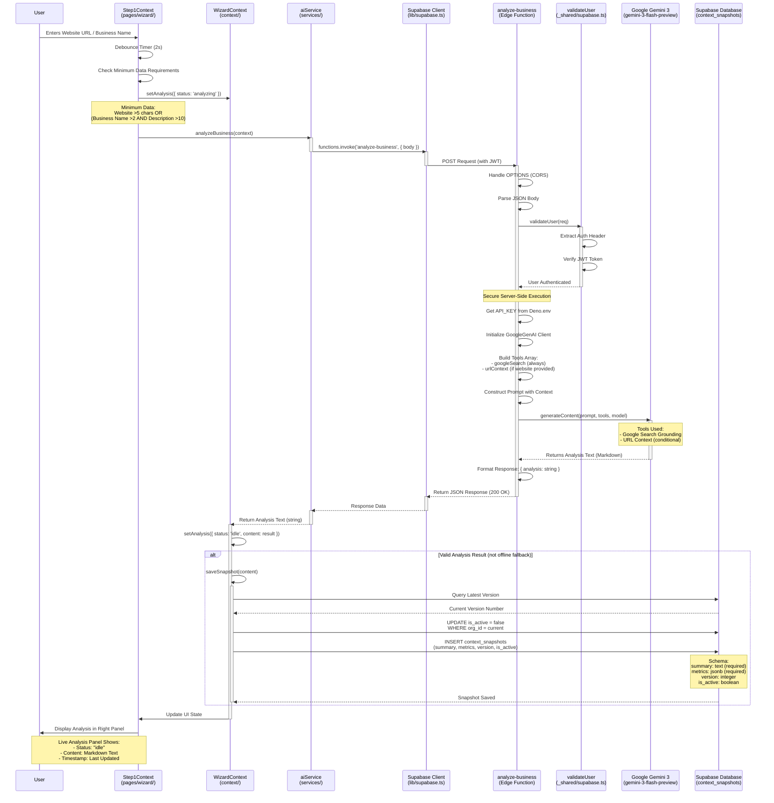
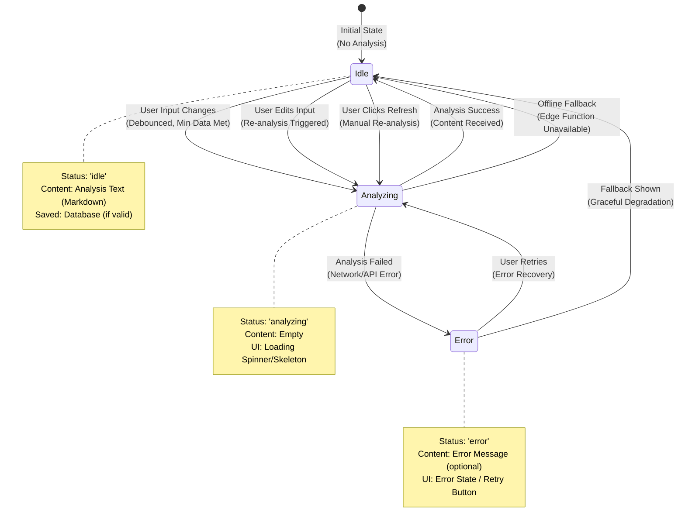
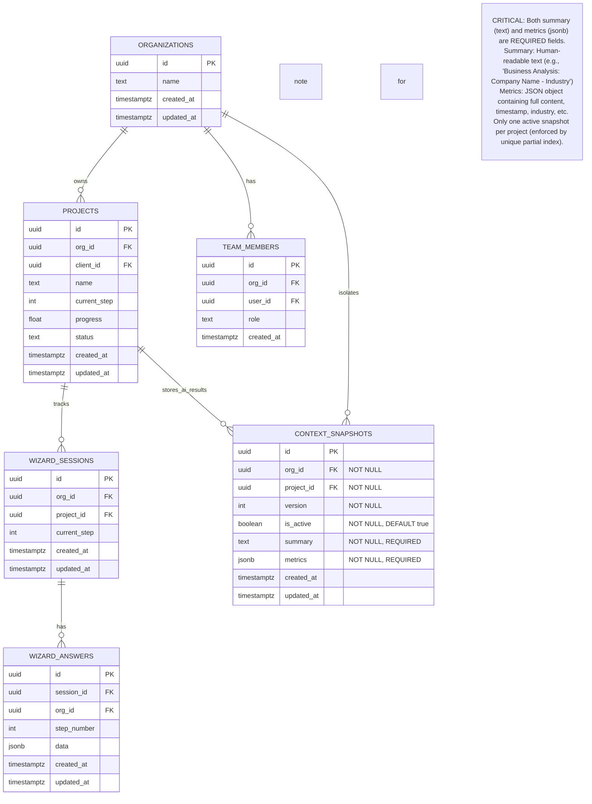
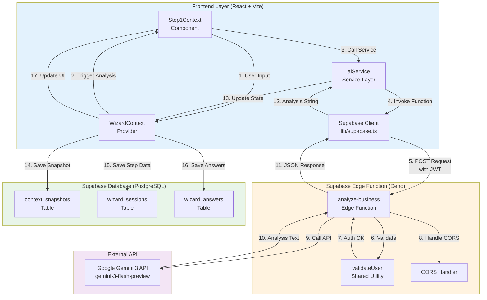
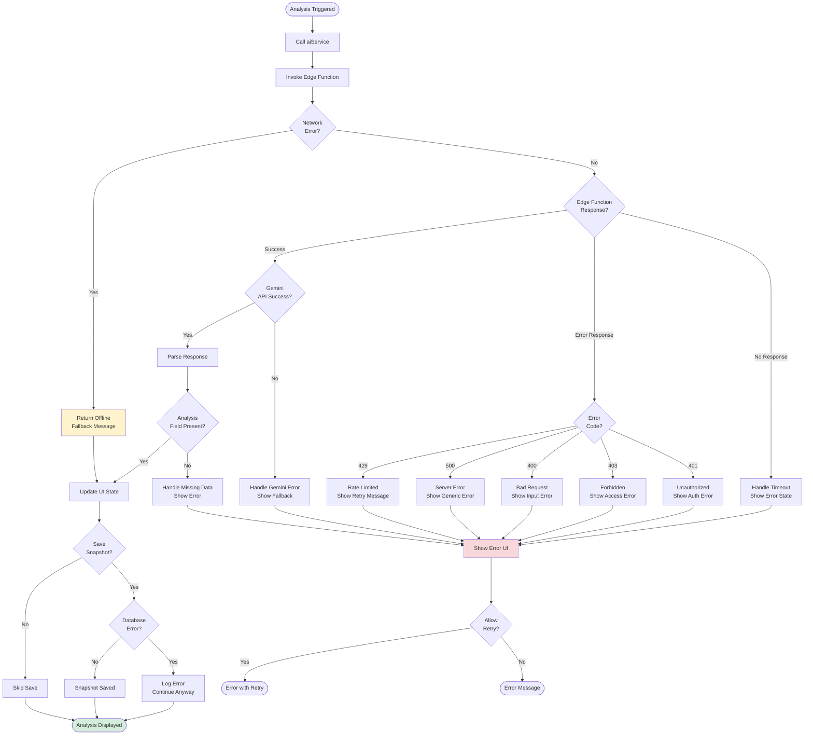
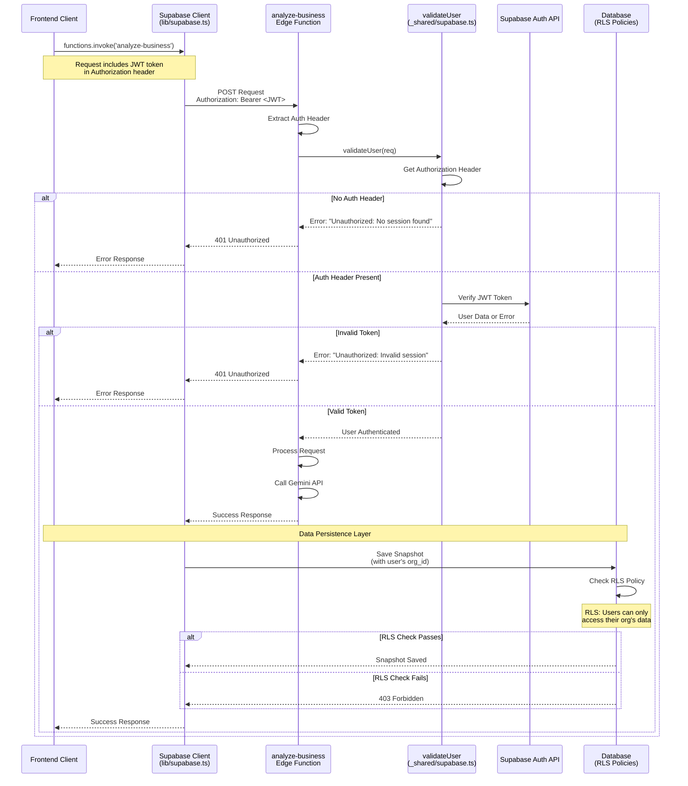

# Mermaid Diagrams: Edge Functions Implementation

**Purpose:** Visual documentation of Edge Functions architecture, data flow, state transitions, and database schema for live Gemini 3 analysis.

**Based On:** Implementation plan from `docs/tasks/01-edge-functions.md`, corrected prompts from `docs/tasks/03-edge-prompts.md`, and audit findings from `docs/tasks/02-audit.md`.

---

## 1. System Flow: Live Analysis Sequence

Complete end-to-end flow from user input to database persistence, showing all components and their interactions.



---

## 2. State Transitions: Analysis Status Flow

State machine diagram showing all possible state transitions for the analysis process, from initial state through analyzing, success, and error scenarios.



---

## 3. Entity Relationship: Database Schema

Complete database schema for wizard sessions, answers, and context snapshots, showing relationships, field types, and constraints.



---

## 4. Data Flow: Request and Response Pipeline

Detailed data flow showing how data transforms through each layer, from user input to database storage.

```mermaid
flowchart TD
    Start([User Fills Form]) --> Input{Minimum Data<br/>Present?}
    Input -->|No| Wait[Wait for More Input]
    Wait --> Input
    Input -->|Yes| Debounce[Debounce Timer<br/>2 seconds]
    Debounce --> CheckStatus{Status =<br/>'analyzing'?}
    CheckStatus -->|Yes| Wait
    CheckStatus -->|No| SetAnalyzing[Set Status:<br/>'analyzing']
    
    SetAnalyzing --> BuildPayload[Build Payload:<br/>businessName, industry,<br/>description, website,<br/>services]
    BuildPayload --> InvokeEdge[Invoke Edge Function:<br/>analyze-business]
    
    InvokeEdge --> AuthCheck{Authentication<br/>Valid?}
    AuthCheck -->|No| AuthError[Return 401<br/>Unauthorized]
    AuthError --> SetError[Set Status:<br/>'error']
    SetError --> ShowError[Show Error UI]
    
    AuthCheck -->|Yes| GetAPIKey[Get API_KEY<br/>from Deno.env]
    GetAPIKey --> InitGemini[Initialize<br/>GoogleGenAI Client]
    InitGemini --> BuildTools{Website<br/>Provided?}
    
    BuildTools -->|Yes| ToolsWithURL[Tools Array:<br/>googleSearch,<br/>urlContext]
    BuildTools -->|No| ToolsBasic[Tools Array:<br/>googleSearch]
    
    ToolsWithURL --> CallGemini[Call Gemini API:<br/>generateContent]
    ToolsBasic --> CallGemini
    
    CallGemini --> GeminiResponse{Success?}
    GeminiResponse -->|No| GeminiError[Handle API Error]
    GeminiError --> SetError
    
    GeminiResponse -->|Yes| ExtractText[Extract Text<br/>from Response]
    ExtractText --> FormatResponse[Format Response:<br/>{ analysis: string }]
    FormatResponse --> ReturnResponse[Return 200 OK<br/>with JSON]
    
    ReturnResponse --> UpdateState[Update State:<br/>status: 'idle',<br/>content: result]
    
    UpdateState --> CheckValid{Result Valid?<br/>Not Offline?}
    CheckValid -->|No| ShowOffline[Show Offline<br/>Fallback]
    CheckValid -->|Yes| SaveSnapshot[Save Snapshot<br/>to Database]
    
    SaveSnapshot --> QueryVersion[Query Latest<br/>Version Number]
    QueryVersion --> DeactivateOld[Deactivate Old<br/>Snapshots]
    DeactivateOld --> BuildSummary[Build Summary Text:<br/>'Business Analysis:<br/>Name - Industry']
    BuildSummary --> BuildMetrics[Build Metrics JSON:<br/>{ content, timestamp,<br/>industry }]
    BuildMetrics --> InsertSnapshot[INSERT context_snapshots<br/>summary + metrics]
    InsertSnapshot --> ShowLive[Show Live Analysis<br/>in UI]
    ShowOffline --> ShowLive
    
    ShowLive([Display Analysis<br/>in Right Panel])
    
    style SaveSnapshot fill:#e1f5ff
    style InsertSnapshot fill:#e1f5ff
    style AuthCheck fill:#fff4e6
    style GeminiResponse fill:#fff4e6
    style CheckValid fill:#fff4e6
```

---

## 5. Component Architecture: Frontend to Backend

High-level architecture diagram showing how frontend components connect to Edge Functions and database.



---

## 6. Error Handling Flow

Complete error handling flow showing all error scenarios and how they are handled at each layer.



---

## 7. Security and Authentication Flow

Detailed security flow showing authentication validation, authorization checks, and data isolation.



---

**Note:** All diagrams are based on 100% accurate implementation requirements from the audit (`docs/tasks/02-audit.md`) and corrected prompts (`docs/tasks/03-edge-prompts.md`). They reflect the actual codebase structure (root-level files, not `src/`), correct database schema (summary + metrics fields), and proper authentication patterns.
